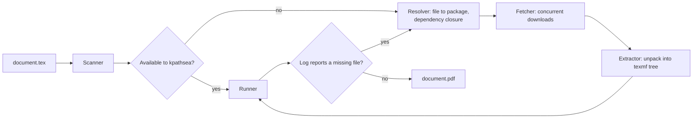

# pomtex

[](https://github.com/Huseynteymurzade28/pomtex/actions/workflows/ci.yml)
[](https://github.com/Huseynteymurzade28/pomtex/releases)
[](https://aur.archlinux.org/packages/pomtex-bin)
[](LICENSE)

pomtex compiles LaTeX documents without a full TeX distribution. It starts from a
small portable TeX kernel and downloads individual CTAN packages only when a
document needs them.

```console
$ pomtex build thesis.tex
● Compiling thesis.tex with pdflatex (rind TeX)
● Fetching 3 arils (48.5KB) with 3 fibers
  ✓ setspace                    7.2KB  309ms
  ✓ cleveref                   27.8KB  336ms
  ✓ enumitem                   13.5KB  483ms
  ✓ 3/3 planted in 490ms
  rerunning for cross-references (pass 2)
  ✓ thesis.pdf (4 pages) in 1.0s

$ pomtex build thesis.tex
● Compiling thesis.tex with pdflatex (rind TeX)
  ✓ thesis.pdf (4 pages) in 156ms
```

## Overview

A complete TeX Live installation is over 5 GB, yet a typical document uses a few
dozen packages. pomtex installs only those packages, and only once:

- No root access is needed. Everything is stored under `~/.cache/pomtex`.
- Dependencies are resolved from TeX Live's own package database (`texlive.tlpdb`), and every download is checked against its SHA-512 checksum.
- If a system TeX installation exists, pomtex uses it and adds the missing packages alongside. If not, it downloads its own kernel on first use.

The name comes from the pomegranate (*pomum granatum*): a thin rind around many
independent seeds. The CLI output uses the same terms:

| Term | Meaning |
|---|---|
| rind | The portable TeX kernel ([TinyTeX](https://yihui.org/tinytex/)), unpacked into `~/.cache/pomtex/rind` |
| aril | A single TeX Live package, such as `geometry` or `pgf` |
| planting | Downloading, verifying and unpacking an aril into `~/.cache/pomtex/texmf` |

## Features

- **Static analysis before compiling.** Detects `\documentclass`, `\usepackage`, `\RequirePackage`, `\usetikzlibrary`, `\usepgfplotslibrary`, beamer themes, babel languages, bibliography styles and fontspec fonts. It follows local `\input`, `\include`, `\subfile` and `\import` chains, and local `.sty` files.
- **Load-graph prefetching.** Packages often load other packages that TeX Live's metadata does not list as dependencies (for example, tcolorbox's `skins` library needs `tikzfill`). pomtex reads the newly installed packages, follows the files they load unconditionally, and installs everything in parallel batches before the first compile.
- **Runtime recovery.** If the log still reports a missing file (`.sty`, `.cls`, TFM, Type 1 `.pfb`, encoding or map file, or a fontspec font), pomtex installs the package that provides it and compiles again.
- **Parallel downloads.** Packages download concurrently on Crystal fibers and are unpacked while the rest are still downloading.
- **Bibliographies.** Runs BibTeX or Biber when the citations, the `.bib` files or the `.bbl` change, then reruns LaTeX until the references settle. Biber is installed from TeX Live on first use, so it always matches the installed biblatex. Missing `.bst` styles are installed like any other package.
- **Engine selection.** Picks XeLaTeX for `fontspec`, `unicode-math` and `polyglossia`, and LuaLaTeX for `\directlua`. A `% !TEX program = ...` comment overrides both.
- **Font handling.** OpenType fonts are resolved by family name and made visible to XeTeX through a generated fontconfig file. Type 1 map files are passed to pdfTeX automatically. If a font name doesn't match any family, pomtex reads the real family names from the installed font files and suggests one, for example `\setmonofont{Inconsolatazi4}` for "Inconsolata".
- **Matching TeX Live releases.** Packages always come from the TeX Live release of the TeX installation in use. Once tlnet moves on to a new year, a kernel from the previous year gets its packages from that year's frozen archive (`tlnet-final`), so a new LaTeX kernel package never meets an old format. `pomtex bootstrap --force` updates the rind to the current release.
- **Safe to run concurrently.** Several pomtex processes can share the cache, for example `pomtex watch` in one terminal and `pomtex build` in another. Writes take an exclusive lock and compiles take a shared one, so a process that waits reuses whatever the other one just installed.
- **Watch mode.** Recompiles on save, with debouncing. It watches every project file the engine actually read (from the `-recorder` log), plus graphics, bibliographies and listings found by the scanner, so it keeps working even when a compile fails part-way. Changes arrive through inotify; files on network file systems (NFS, SMB, sshfs, WSL's `/mnt`) are polled instead.
- **Single binary.** About 3 MB dynamically linked, or about 8 MB fully static.

## Installation

### Any Linux distribution (install script)

```sh
curl -fsSL https://raw.githubusercontent.com/Huseynteymurzade28/pomtex/main/install.sh | sh
```

On Debian and Ubuntu the script installs the `.deb`, on Fedora and openSUSE the `.rpm` (both through the system package manager, so it asks for `sudo`). Elsewhere it puts the static binary, completions and man page under `~/.local`. Run it again to update. Options go before `sh`:

```sh
curl -fsSL https://raw.githubusercontent.com/Huseynteymurzade28/pomtex/main/install.sh | POMTEX_LOCAL=1 sh   # no sudo, ~/.local
curl -fsSL https://raw.githubusercontent.com/Huseynteymurzade28/pomtex/main/install.sh | PREFIX=/opt/pomtex sh
```

### Arch Linux (AUR)

```sh
yay -S pomtex-bin     # prebuilt static binary
yay -S pomtex         # build from source
```

### Debian, Ubuntu, Fedora, openSUSE (packages)

The [latest release](https://github.com/Huseynteymurzade28/pomtex/releases/latest) has a `.deb` and an `.rpm`:

```sh
sudo apt install ./pomtex_*_amd64.deb                                 # Debian, Ubuntu
sudo dnf install ./pomtex-*.x86_64.rpm                                # Fedora
sudo zypper install --allow-unsigned-rpm ./pomtex-*.x86_64.rpm        # openSUSE
```

### Prebuilt binary

```sh
curl -L https://github.com/Huseynteymurzade28/pomtex/releases/latest/download/pomtex-0.3.1-linux-x86_64.tar.gz | tar xz
install -Dm755 pomtex-0.3.1-linux-x86_64/pomtex ~/.local/bin/pomtex
```

The binary is statically linked and runs on any x86_64 Linux distribution.

### From source

Requires [Crystal](https://crystal-lang.org/install/) 1.10 or newer.

```sh
git clone https://github.com/Huseynteymurzade28/pomtex.git
cd pomtex
make install          # installs to ~/.local/bin
```

### Runtime requirements

- `xz`, used to unpack TeX Live packages. It is preinstalled on almost every distribution.
- An internet connection the first time a package is needed.

## Examples

The [`examples/`](examples) directory contains documents that you can compile directly:

| Example | Demonstrates |
|---|---|
| [`article/article.tex`](examples/article/article.tex) | TikZ libraries, `tikz-cd`, `siunitx`, `booktabs`; dependency resolution (`pgf`, `fp`, …) |
| [`fonts/fonts.tex`](examples/fonts/fonts.tex) | Automatic XeLaTeX selection, OpenType fonts fetched by family name |
| [`beamer/slides.tex`](examples/beamer/slides.tex) | Beamer class and themes installed on demand |
| [`thesis/thesis.tex`](examples/thesis/thesis.tex) | Multi-file project, local style file, cross-references across chapters |
| [`bibtex/paper.tex`](examples/bibtex/paper.tex) | BibTeX with natbib; BibTeX runs only when citations or `refs.bib` change |
| [`biblatex/paper.tex`](examples/biblatex/paper.tex) | biblatex with Biber; the `biber` binary is installed on first use |

```sh
pomtex build examples/article/article.tex
pomtex build examples/fonts/fonts.tex
```

### Checking a document before compiling

`pomtex scan` lists everything a document needs and where each missing file comes from,
without downloading anything:

```console
$ pomtex scan examples/thesis/thesis.tex
thesis.tex → pdflatex
sources: thesis.tex, thesisstyle.sty, chapters/introduction.tex, chapters/results.tex
  ✗ cleveref.sty  → aril cleveref
  ✗ enumitem.sty  → aril enumitem
  ✓ geometry.sty
  ✓ hyperref.sty
  ✓ report.cls
  ✗ setspace.sty  → aril setspace
```

`setspace`, `enumitem` and `cleveref` are loaded only inside the local
`thesisstyle.sty`, and the scanner still finds them.

### Fonts by name

```latex
\usepackage{fontspec}
\setmainfont{Libertinus Serif}
\setsansfont{Fira Sans}
```

```console
$ pomtex build examples/fonts/fonts.tex
● Compiling fonts.tex with xelatex (rind TeX)
● Fetching 2 arils (16.5MB) with 2 fibers
  ✓ libertinus-fonts           1.72MB  1.9s
  ✓ fira                       14.8MB  7.8s
  ✓ 2/2 planted in 7.8s
  ✓ fonts/fonts.pdf (1 page) in 8.2s
```

### Packages the scanner cannot see

Packages loaded through macros are caught at runtime:

```latex
\newcommand\pkg{lipsum}
\expandafter\usepackage\expandafter{\pkg}
```

```console
● Runtime guard caught lipsum.sty
● Fetching 1 aril (122KB) with 1 fibers
  ✓ lipsum                      122KB  360ms
  ✓ hidden.pdf (1 page) in 2.0s
```

### Bibliographies

```console
$ pomtex build examples/biblatex/paper.tex
● Compiling paper.tex with pdflatex (rind TeX)
● Fetching 1 aril (24.7MB) with 1 fibers
  ✓ biber.x86_64-linux         24.7MB  11.4s
  ✓ 1/1 planted in 11.4s
● Running biber
  ✓ biber in 2.8s
  rerunning for cross-references (pass 2)
  ✓ paper.pdf (1 page) in 23.1s

$ pomtex build examples/biblatex/paper.tex     # nothing changed: Biber is skipped
● Compiling paper.tex with pdflatex (rind TeX)
  ✓ paper.pdf (1 page) in 486ms
```

### Live preview

```sh
pomtex watch thesis.tex       # recompiles when any .tex, figure, .bib or listing changes
```

Use it with a PDF viewer that reloads automatically, such as Zathura, Okular or Evince.

## Usage

```text
pomtex <command> [options]
```

| Command | Description |
|---|---|
| `build <file.tex>` | Compile, installing missing packages as needed. `pomtex file.tex` is a shortcut. |
| `watch <file.tex>` | Recompile whenever the document or any of its inputs changes |
| `scan <file.tex>` | Report required files, what is installed and which package provides the rest |
| `fetch <name>...` | Install packages by package name (`mhchem`) or file name (`tikz-cd.sty`) |
| `bootstrap [--force]` | Download the TeX kernel. This also happens automatically on first build. |
| `index [--refresh]` | Build or refresh the file-to-package index |
| `list [--names]` | List installed packages (`--names`: names only) |
| `remove <name>...` | Remove installed packages |
| `clean [--all]` | Remove all installed packages. `--all` also removes the kernel and the index. |
| `doctor` | Show the detected TeX installation, cache state and requirements |
| `completions <shell>` | Print shell completions for `bash`, `fish` or `zsh` |
| `manpage` | Print the man page (roff) |

| Option | Description |
|---|---|
| `-e`, `--engine=ENGINE` | `pdflatex`, `xelatex` or `lualatex` (default: detected from the source) |
| `-o`, `--outdir=DIR` | Output directory for the PDF and auxiliary files |
| `-j`, `--jobs=N` | Number of concurrent downloads (default: 6) |
| `--offline` | Do not use the network; report what would be installed |
| `--rind` | Use the pomtex kernel even if a system TeX is installed |
| `--stream` | Print the TeX engine's output while compiling |
| `--debounce=MS` | Quiet period before `watch` recompiles (default: 350) |
| `-v`, `--verbose` | Explain each decision |
| `-q`, `--quiet` | Print errors only |

### Shell completions and man page

The AUR packages and `make install` install completions for bash, fish and zsh and the
`pomtex(1)` man page. With the release tarball, install them by hand:

```sh
pomtex completions fish > ~/.config/fish/completions/pomtex.fish
pomtex completions bash > ~/.local/share/bash-completion/completions/pomtex
pomtex completions zsh  > "${fpath[1]}/_pomtex"
pomtex manpage > ~/.local/share/man/man1/pomtex.1
```

Both are generated from `pomtex --help`, so they always match the installed version.

### Environment variables

| Variable | Default | Description |
|---|---|---|
| `POMTEX_HOME` | `$XDG_CACHE_HOME/pomtex` | Location of all pomtex data |
| `POMTEX_MIRROR` | `https://mirror.ctan.org/systems/texlive/tlnet` | TeX Live repository used for packages |
| `POMTEX_HISTORIC_MIRROR` | `https://ftp.math.utah.edu/pub/tex/historic/systems/texlive` | Archive of past TeX Live releases, used when the TeX kernel is older than tlnet |
| `POMTEX_RIND_VERSION` | latest TinyTeX release | Pin the kernel version, for example `v2026.10` |
| `POMTEX_RIND_URL` | GitHub release asset | Download the kernel from a custom URL |
| `POMTEX_USE_RIND` | unset | Equivalent to `--rind` |

## How it works



1. **Detection.** Use the system `pdflatex` and `kpsewhich` if present. Otherwise use the pomtex kernel, downloading it first if necessary (TinyTeX-1, about 51 MB).
2. **Scanning.** Parse the document and every local file it includes, with comments removed.
3. **Resolution.** The first time something is missing, pomtex downloads `texlive.tlpdb` (2.7 MB) and builds an index of about 185,000 files across 4,900 packages. It maps each missing file to a package, then checks that package's dependencies layer by layer with batched `kpsewhich` calls. It then scans the newly installed package files and follows their top-level `\RequirePackage`, `\input` and library loads until nothing new turns up. Loads nested inside braces are skipped because they are usually conditional.
4. **Download and unpack.** `tlnet/archive/<package>.tar.xz` is streamed and its SHA-512 verified. It is then unpacked by a built-in tar reader that rejects path traversal.
5. **Compilation.** The engine runs with the package tree added to its search paths (`TEXINPUTS`, `TEXMFAUXTREES`). It also gets a fontconfig file for XeTeX and the font map files needed by pdfTeX.
6. **Recovery.** pomtex reads the log, installs any packages that are still missing and compiles again, for up to 8 rounds.
7. **Bibliography and passes.** If the citations, `.bib` files or `.bbl` changed, pomtex runs BibTeX or Biber, then reruns LaTeX for cross-references, up to 3 passes.

Data layout:

```text
~/.cache/pomtex/
├── rind/        TeX kernel (bin/x86_64-linux/pdflatex, formats, ...)
├── texmf/       installed packages
├── arils/       one manifest per installed package
├── index/       file-to-package index
├── fonts.conf   fontconfig configuration for XeTeX
└── downloads/   temporary download files
```

## Development

```sh
make            # debug build: bin/pomtex
make spec       # run the test suite
make lint       # check formatting
make release    # optimised build
make static     # fully static binary, built in an Alpine container (requires Docker)
```

Source layout:

```text
src/
├── pomtex.cr               command-line interface
├── config.cr               paths, constants, built-in file-to-package hints
├── ui.cr                   terminal output
├── help.cr                 shell completions and man page from --help
├── core/
│   ├── detector.cr         TeX installation detection, batched kpsewhich
│   └── bootstrap.cr        kernel download and installation
├── seed/
│   ├── scanner.cr          static analysis of .tex sources
│   ├── resolver.cr         package index, dependency resolution, manifests
│   ├── aril_fetcher.cr     concurrent download and unpack pipeline
│   └── extractor.cr        streaming tar reader
├── engine/
│   ├── runner.cr           engine invocation and environment
│   ├── runtime_guard.cr    log analysis and recovery
│   └── bibliography.cr     BibTeX/Biber detection and runs
└── watcher/
    ├── live_pulse.cr       file watching with debouncing
    └── inotify.cr          inotify binding, network file system detection
```

To publish a release, bump `version` in `shard.yml` and `VERSION` in
`src/config.cr`, then push a `vX.Y.Z` tag. The release workflow builds the static
binary and attaches it to a GitHub release.

## Limitations

- **The kernel is larger than intended.** TinyTeX-1 is a 51 MB download and about 190 MB unpacked. A smaller pdfTeX-only kernel is planned ([#1](https://github.com/Huseynteymurzade28/pomtex/issues/1)).
- Only Linux x86_64 is supported ([#8](https://github.com/Huseynteymurzade28/pomtex/issues/8)).
- Packages always come from the current TeX Live release. A kernel from an older release may need `pomtex bootstrap --force` after the yearly TeX Live update ([#7](https://github.com/Huseynteymurzade28/pomtex/issues/7)).

## Acknowledgements

pomtex relies on [TeX Live](https://tug.org/texlive/) and [CTAN](https://ctan.org)
for packages and package metadata, and on [TinyTeX](https://yihui.org/tinytex/)
for the portable kernel.

## License

[MIT](LICENSE)
