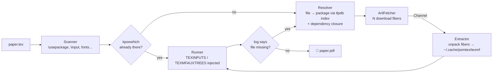

<div align="center">

# 🍎 pomtex

**The pomegranate TeX engine — a featherlight rind, arils on demand.**

Compile LaTeX without hauling a 5 GB TeX Live install.
`pomtex` grows a portable TeX kernel in user space and pulls each CTAN package
only at the moment a document asks for it.

[](https://github.com/Huseynteymurzade28/pomtex/actions/workflows/ci.yml)


</div>

```console
$ pomtex build paper.tex
● Compiling paper.tex with pdflatex (rind TeX)
● Fetching 7 arils (1.01MB) with 6 fibers
  ✓ fp                         18.8KB  299ms
  ✓ environ                    1.86KB  290ms
  ✓ siunitx                    69.4KB  335ms
  ✓ tikz-cd                    6.23KB  334ms
  ✓ tcolorbox                   231KB  588ms
  ✓ pgf                         702KB  770ms
  ✓ trimspaces                   920B  487ms
  ✓ 7/7 planted in 805ms
  rerunning for cross-references (pass 2)
  ✓ paper.pdf (1 page) in 3.5s
```

---

## Why a pomegranate?

A pomegranate (*pomum granatum*, "seeded apple") is a thin rind wrapped around
hundreds of independent seeds. `pomtex` is built the same way:

| | Pomegranate | pomtex |
|---|---|---|
| 🛡️ | **Rind** | A portable TeX kernel (TinyTeX-1: pdfTeX, XeTeX, LuaTeX + formats), unpacked once into `~/.cache/pomtex/rind` |
| 🔴 | **Arils** | Individual CTAN packages (`.sty`, `.cls`, fonts…) fetched only when a document needs them |
| 🌱 | **Growing** | No root, no system packages, nothing outside `~/.cache/pomtex` |

## Features

- **On-demand packages.** Before compiling, pomtex reads your sources (`\usepackage`, `\documentclass`, `\usetikzlibrary`, `\usetheme`, `\setmainfont`, `\input`…) and fetches whatever kpathsea can't find. It follows dependencies too.
- **Runtime guard.** If LaTeX still reports a missing file mid-run (`File 'x.sty' not found`, missing TFM, encoding or map file, a fontspec font), pomtex fetches the right package and recompiles.
- **Concurrent fetching.** Crystal fibers download in parallel and hand archives over a `Channel` to unpacker fibers, so unpacking overlaps with downloading.
- **Verified.** Every package is checked against the SHA-512 in TeX Live's `texlive.tlpdb`. If a checksum doesn't match, the index is refreshed and the download retried.
- **Picks the engine.** `fontspec`, `unicode-math` or `polyglossia` select XeLaTeX; `\directlua` selects LuaLaTeX; a `% !TEX program = …` comment overrides both.
- **Fonts work.** OpenType fonts are fetched by family name (`\setmainfont{Libertinus Serif}` fetches `libertinus-fonts`). Type 1 font maps are injected for pdfTeX automatically.
- **Watch mode.** `pomtex watch` rebuilds on save, with debouncing and tracking of every `\input`ed file.
- **Uses your TeX if you have one.** With a system `pdflatex`, pomtex adds packages on top of it. With no TeX installed, it bootstraps its own.
- **Small binary.** About 3 MB, with a fully static musl build target.

## Install

### From source

You need [Crystal](https://crystal-lang.org/install/) ≥ 1.10 and `xz` (used to unpack `.tar.xz` packages).

```sh
git clone https://github.com/Huseynteymurzade28/pomtex.git
cd pomtex
make install          # release build → ~/.local/bin/pomtex
```

On Arch: `sudo pacman -S crystal shards xz`.

### Static binary

```sh
make static           # builds in crystallang/crystal:latest-alpine via Docker
```

## Usage

```sh
pomtex build thesis.tex          # compile; fetch whatever is missing
pomtex watch thesis.tex          # rebuild on every save
pomtex scan thesis.tex           # show what the document needs and what's missing
```

<details>
<summary><b>Example: <code>pomtex scan</code></b></summary>

```console
$ pomtex scan xe.tex
xe.tex → xelatex
sources: xe.tex
  ✓ article.cls
  ✓ fontspec.sty
  font "Libertinus Serif" → aril libertinus-fonts
```

</details>

### Commands

| Command | Description |
|---|---|
| `pomtex build <file.tex>` | Compile, fetching missing packages on the fly (`pomtex file.tex` also works) |
| `pomtex watch <file.tex>` | Rebuild when the document or anything it inputs changes |
| `pomtex scan <file.tex>` | List required files, which are present, and which package provides the rest |
| `pomtex fetch <pkg\|file>…` | Fetch packages explicitly: `pomtex fetch mhchem tikz-cd.sty` |
| `pomtex bootstrap [--force]` | Download the rind (also happens automatically on first build) |
| `pomtex index [--refresh]` | Build or refresh the CTAN file → package index |
| `pomtex list` | Show installed packages |
| `pomtex remove <aril>…` | Remove packages and prune their files |
| `pomtex clean [--all]` | Remove all packages (`--all`: also the rind and the index) |
| `pomtex doctor` | Show what pomtex sees on this machine |

### Options

| Option | Description |
|---|---|
| `-e, --engine=ENGINE` | `pdflatex`, `xelatex` or `lualatex` (default: auto-detect) |
| `-o, --outdir=DIR` | Where the PDF and auxiliary files go |
| `-j, --jobs=N` | Concurrent downloads (default 6) |
| `--offline` | Never touch the network; only report what would be fetched |
| `--rind` | Use the pomtex rind even when a system TeX exists |
| `--stream` | Show the engine's own output |
| `--debounce=MS` | Watch mode quiet period (default 350 ms) |
| `-v` / `-q` | Verbose / quiet |

### Environment

| Variable | Default | Purpose |
|---|---|---|
| `POMTEX_HOME` | `$XDG_CACHE_HOME/pomtex` or `~/.cache/pomtex` | Everything pomtex stores |
| `POMTEX_MIRROR` | `https://mirror.ctan.org/systems/texlive/tlnet` | TeX Live repository to fetch packages from |
| `POMTEX_RIND_VERSION` | latest TinyTeX release | Pin a TinyTeX release tag, e.g. `v2026.10` |
| `POMTEX_RIND_URL` | GitHub release asset | Custom rind tarball |
| `POMTEX_USE_RIND` | unset | Same as `--rind` |

## How it works



1. **Detect.** Look for a system `pdflatex` + `kpsewhich`, otherwise use the rind. If neither exists, bootstrap the rind (TinyTeX-1, about 51 MB download).
2. **Scan.** Statically parse the document and every local file it inputs. Comments are stripped and local `.sty` files are followed.
3. **Resolve.** On the first miss, pomtex downloads `texlive.tlpdb` (≈2.7 MB) and builds a compact index of about 185k run files across about 4.9k packages. Requested files map to packages; dependencies are probed layer by layer with batched `kpsewhich` calls, and only missing ones are fetched.
4. **Fetch & unpack.** `tlnet/archive/<pkg>.tar.xz` is streamed with redirects followed and SHA-512 verified, then unpacked by a built-in tar reader (ustar, GNU long names, PAX, path-traversal checks).
5. **Run.** The engine runs with the package tree added to kpathsea (`TEXINPUTS`, `TEXMFAUXTREES`). It also gets a generated `fonts.conf` so XeTeX finds fonts by name, and `\pdfmapfile{+…}` for new Type 1 fonts.
6. **Guard.** The log is parsed for anything still missing; pomtex fetches it and retries (up to 8 rounds), then reruns for cross-references (up to 3 passes).

### On-disk layout

```text
~/.cache/pomtex/
├── rind/         portable TeX kernel (bin/x86_64-linux/pdflatex, …)
├── texmf/        installed packages (tex/, fonts/, …)
├── arils/        one manifest per package (its files and font maps)
├── index/        file → package index built from texlive.tlpdb
├── fonts.conf    fontconfig overlay for XeTeX
└── downloads/    in-flight archives
```

## Project layout

```text
src/
├── pomtex.cr               CLI entry point (OptionParser)
├── config.cr               paths, constants, built-in file → package hints
├── ui.cr                   terminal output
├── core/
│   ├── detector.cr         finds system TeX or the rind; batched kpsewhich
│   └── bootstrap.cr        downloads and unpacks TinyTeX
├── seed/
│   ├── scanner.cr          static .tex analysis
│   ├── resolver.cr         tlpdb index, dependency closure, package manifest
│   ├── aril_fetcher.cr     fiber/Channel download → unpack pipeline
│   └── extractor.cr        streaming tar reader (gzip native, xz via pipe)
├── engine/
│   ├── runner.cr           engine subprocess + environment injection
│   └── runtime_guard.cr    log parsing, fetch-and-retry, rerun passes
└── watcher/
    └── live_pulse.cr       polling watcher with Channel/select debouncing
```

## Development

```sh
make            # debug build → bin/pomtex
make spec       # run the spec suite
make lint       # crystal tool format --check
make fmt        # format sources
```

## Limitations

- **The rind is heavier than a pomegranate rind should be.** TinyTeX-1 is about 51 MB to download and about 190 MB unpacked, because it bundles three engines. A slimmer pdfTeX-only rind is on the roadmap.
- Linux x86_64 only for now.
- No `bibtex`/`biber` runs yet.
- `xz` must be installed to unpack packages.
- Packages always come from the current TeX Live release. If the rind is from an older TeX Live year, formats may not match.

See the [issues](https://github.com/Huseynteymurzade28/pomtex/issues) for the roadmap.

## Acknowledgements

- [TeX Live](https://tug.org/texlive/) and [CTAN](https://ctan.org) for the packages and `texlive.tlpdb`.
- [TinyTeX](https://yihui.org/tinytex/) for the portable kernel.
- [Crystal](https://crystal-lang.org) for fibers, channels and fast native binaries.

## License

[MIT](LICENSE) © Hüseyn Teymurzade
